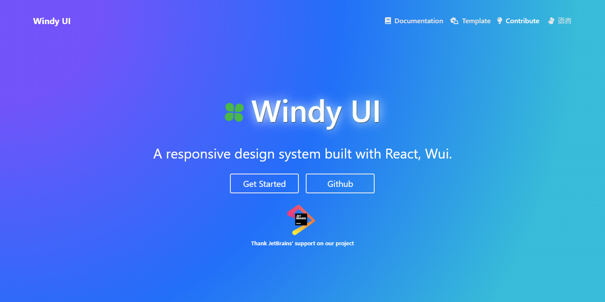

## Documentation

For documentation, please refer to this link: `http://wui.super666.xyz`

## React Windy UI



- **_Current release: 0.6.1_**

## 这个框架的由来

我们都需要一个框架，却往往又陷入讨厌和贬低这个框架的泥潭里。 为何不自己做一个呢？这样至少可以少一个让自己讨厌的理由，这便是我要做一套 UI 框架的初衷。
因为讨厌反复去学别的框架，所以自己做一个，也希望有机会被别的人所讨厌， 也许到那个时候也算是一种成功吧。

最初这个框架取名为 Wui， 首字母 W 是英文单词轮子的首字母。意指这是一个轮子项目，虽然一开始只是抱着尽量去做的想法， 只是没有想到能坚持到现在。
最初还是 2016 年启动，那个时候只想做一套基于 scss 的 web 皮肤框架，但越到后面 越是发现，走组件化的路子是不可避免的。
于是借着 react 的东风，便从 2018 年启动了 react 组建化的工作。这么多年， 从最初一个人，坚持原型设计，再到参考和借鉴其他框架，着实费了不少精力和时间。
但是当这个成果慢慢到收获的时候，一切 都那么充实。不多说了，继续努力，坚持下去，终有收获的那天的。

We all need a framework, but we often fall into the quagmire of hating and degrading this framework.
Why not make one yourself? In this way, at least one less reason to hate, this is my original intention to make a UI framework.
Because I hate to learn other frameworks repeatedly, I make one myself and hope to have the opportunity to be hated by other people. Maybe it will be a success by then.

Originally, this framework was named Wui, with the first letter W being the first letter of the English word wheel.
It means that this is a wheel project, although at the beginning it was just the idea of doing it as much as possible.
But I didn't expect to stick to it till now, it was initially launched in 2016. At that time, I only wanted to build a web skin framework based on scss.
Therefore, with the help of react, the work of react formation was started in 2018. For so many years, it took a lot of energy and time from
the first person to insist on prototyping, and then to refer to and learn from other frameworks.
But when the results slowly reach the harvest, everything is so fulfilling.
Not much to say, continue to work hard, persevere, and there will be a harvest that day.

## How to install

You can install by npm or yarn:

```js
npm install react-windy-ui
or
yarn add react-windy-ui
```

## Create a sample project

- create a project 'my-app' by create-react-app tool

```js
yarn create react-app my-app
# or
npx create-react-app my-app
```

- install react-windy-ui

```js
npm install
npm install react-windy-ui
```

- modify the App.js

```js
import React from 'react';
import { Button } from 'react-windy-ui';
import 'react-windy-ui/dist/wui.css'; #import the default theme file
const App = () => {
  return <Button type="primary">Hello</Button>
};
export default App;
```

- run this project and there should be a button on the page
