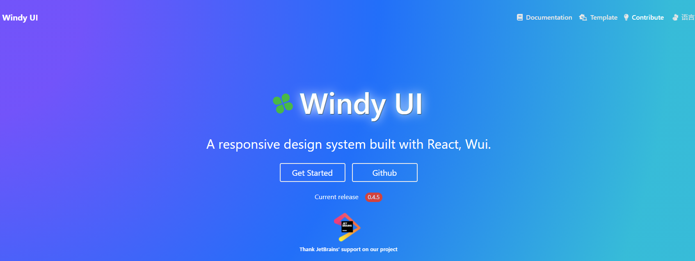

## Documentation
For documentation, please refer to this link:  ```http://super666.cn```

## React Windy UI



## 这个框架的由来
我们都需要一个框架，却往往又陷入讨厌和贬低这个框架的泥潭里。 为何不自己做一个呢？这样至少可以少一个让自己讨厌的理由，这便是我要做一套UI 框架的初衷。 
因为讨厌反复去学别的框架，所以自己做一个，也希望有机会被别的人所讨厌， 也许到那个时候也算是一种成功吧。  

最初这个框架取名为Wui， 首字母W是英文单词轮子的首字母。意指这是一个轮子项目，虽然一开始只是抱着尽量去做的想法， 只是没有想到能坚持到现在。
最初还是2016年启动，那个时候只想做一套基于scss的web皮肤框架，但越到后面 越是发现，走组件化的路子是不可避免的。
于是借着react的东风，便从2018年启动了react组建化的工作。这么多年， 从最初一个人，坚持原型设计，再到参考和借鉴其他框架，着实费了不少精力和时间。
但是当这个成果慢慢到收获的时候，一切 都那么充实。不多说了，继续努力，坚持下去，终有收获的那天的。

## How to install
You can install by npm or yarn:
```js
npm install react-windy-ui
or
yarn add react-windy-ui
```

## Create a sample project
* create a project 'my-app' by create-react-app tool
```js
yarn create react-app my-app
# or
npx create-react-app my-app
```
* install react-windy-ui 
```js
npm install
npm install react-windy-ui
```

* modify the App.js 
```js
import React from 'react';
import { Button } from 'react-windy-ui';
import 'react-windy-ui/dist/wui.css'; #import the default theme file
const App = () => {
  return <Button type="primary">Hello</Button>
};
export default App;
```
* run this project and there should be a button on the page
